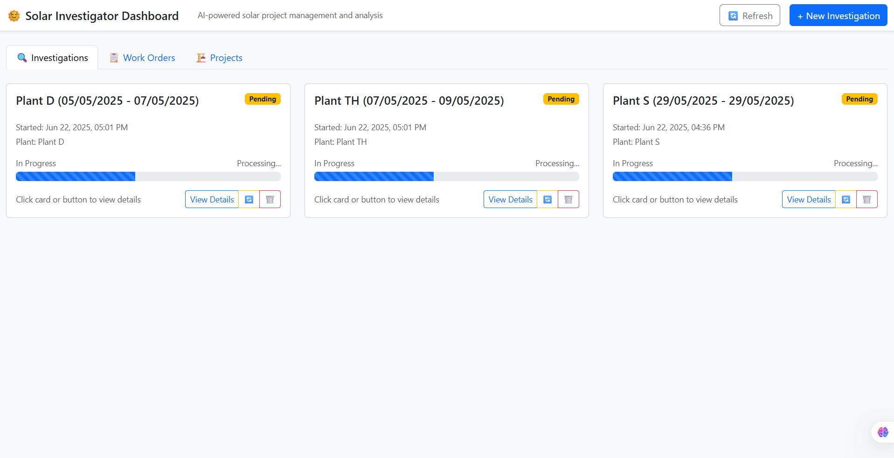
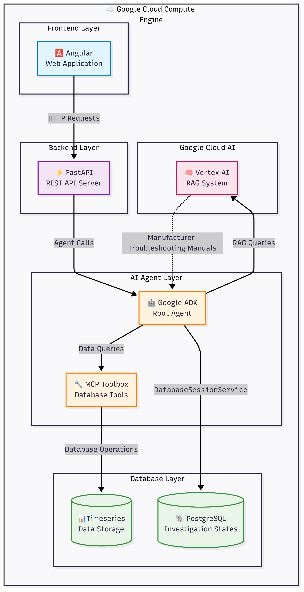
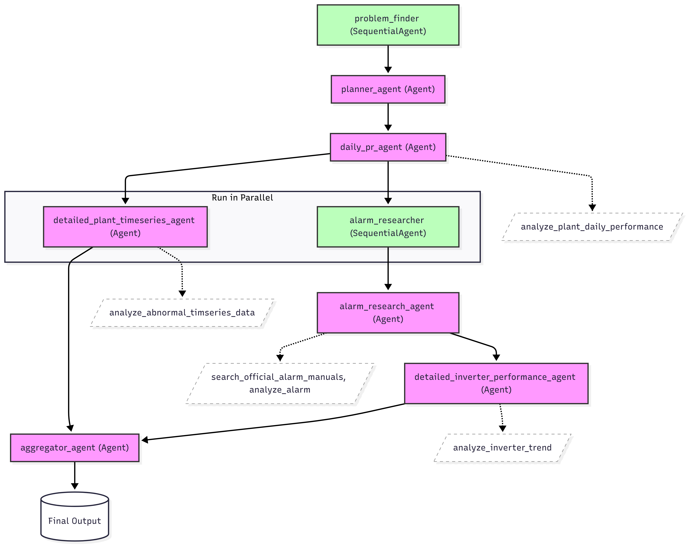

# SolarWarden: AI Copilot for Solar Farm Operations

SolarWarden is a data-driven copilot for solar farm operators — pinpointing low-performing inverters, running on-demand investigations, and involving humans only when field checks are needed. Powered by Google's Agent Development Kit (ADK) and Gemini LLM, SolarWarden automates root-cause analysis and streamlines solar O&M workflows.



---

## 🚀 Features

- **AI-Powered Investigations:** Multi-agent system analyzes plant, inverter, and alarm data to detect and explain performance drops.
- **Real-Time Insights:** Live streaming of investigation results and recommendations.
- **Workorder Automation:** Instantly generate and track maintenance workorders from investigation findings.
- **Modern Dashboard:** Angular-based UI for managing investigations, workorders, and projects.
- **Cloud-Ready:** Integrates with Google Cloud and Vertex AI for scalable, enterprise-grade performance.

---

## 🛠️ Tech Stack

| Layer      | Technology/Tool         | Purpose                                      |
|------------|------------------------|----------------------------------------------|
| Frontend   | Angular, TypeScript    | User interface, dashboard, investigation UI  |
| Styling    | Bootstrap              | UI styling                                   |
| Backend    | FastAPI, Python        | API, business logic, agent orchestration     |
| AI/Agents  | Google ADK, Gemini     | Multi-agent investigation, LLM analysis      |
| Streaming  | SSE                    | Real-time updates to frontend                |
| Cloud      | Google Cloud (optional)| Advanced AI/LLM and data integration         |

### 📊 Tech Stack Diagram



---

## 🏗️ Google ADK Architecture

The following diagram illustrates the architecture of the Google Agent Development Kit (ADK) as used in this project:



---

## 📦 Project Structure

```
solarinvestigatoradk/
├── backend/
│   ├── src/adk/           # ADK agents, tools, services, models
│   └── main.py            # FastAPI entry point
├── frontend/
│   ├── src/app/           # Angular components, services, models
│   └── ...                # Angular config and assets
├── docker-compose.yml     # Multi-service orchestration
├── Dockerfile             # Container build for backend/frontend
└── README.md              # This file
```

---

## ⚡ Getting Started

### Prerequisites

- Python 3.9+
- Node.js & npm
- Docker
- Google Cloud credentials (for advanced AI features)

### 1. Clone the Repository

```bash
git clone https://github.com/liongkj/solarinvestigatoradk.git
cd solarinvestigatoradk
```

### 2. Backend Setup

```bash
cd backend
uv sync
cp .env.example .env
# Edit .env with your Google Cloud and Gemini API keys
uv run python src/main.py
```

### 3. Frontend Setup

```bash
cd ../frontend
npm install
ng serve
# Visit http://localhost:4200/
```

### 4. Docker Setup

```bash
docker-compose up --build
```

---

## 🧠 How It Works

1. **Start an Investigation:** Select a plant and date range in the dashboard.
2. **AI Agents Analyze Data:** Specialized agents (PR, inverter, alarm, timeseries) run in sequence/parallel to diagnose issues.
3. **Get Actionable Results:** Receive a clear summary of root causes, affected devices, and recommended actions.


---

## 📊 Demo

1. **Dashboard:** View all investigations, workorders, and projects.
2. **Start Investigation:** Launch a new investigation with a few clicks.
3. **Review Results:** See detailed findings, summaries, and next steps.
4. **Workorder Management:** Create and track workorders directly from investigation results.

---

## 📝 License

Apache License 2.0

---

## 🙌 Acknowledgements

- Google Agent Development Kit (ADK)
- Google Gemini LLM
- Vertex AI
- Angular & FastAPI communities

---

**SolarWarden — Smarter, faster, and more cost-effective solar farm operations.**